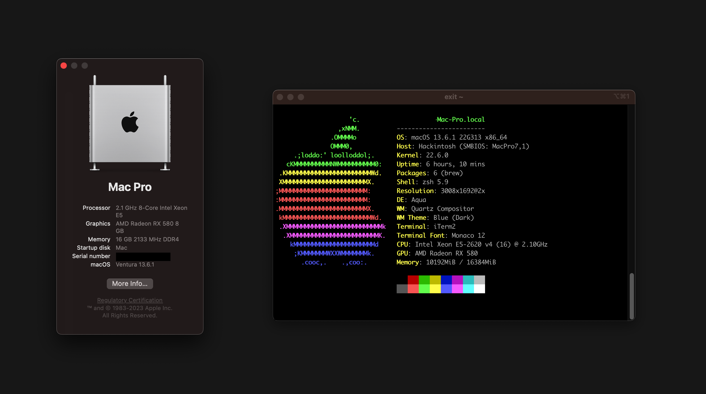
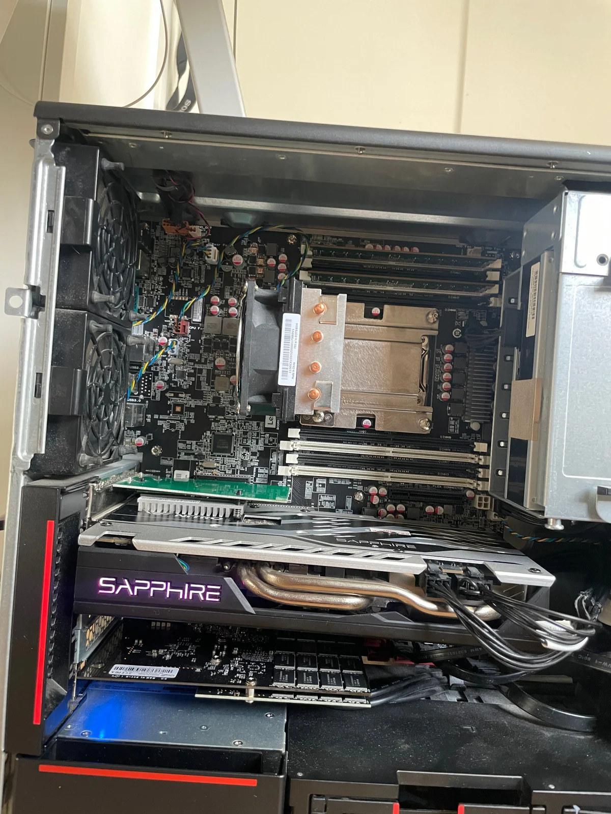
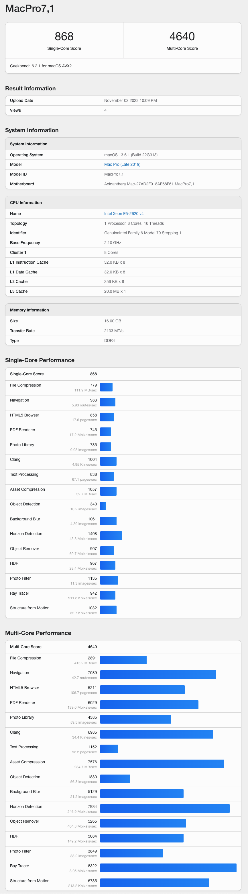
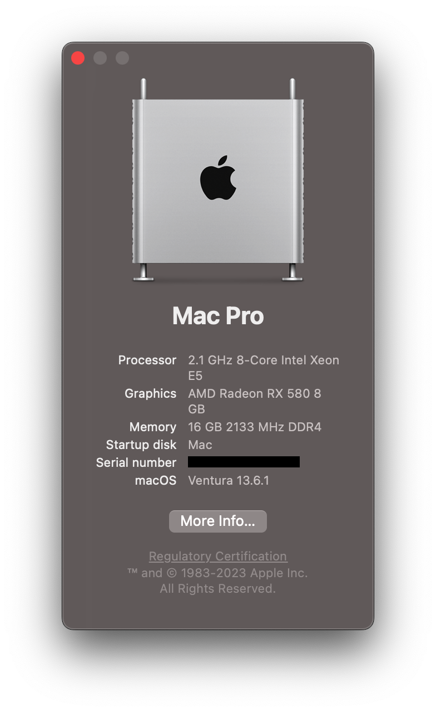
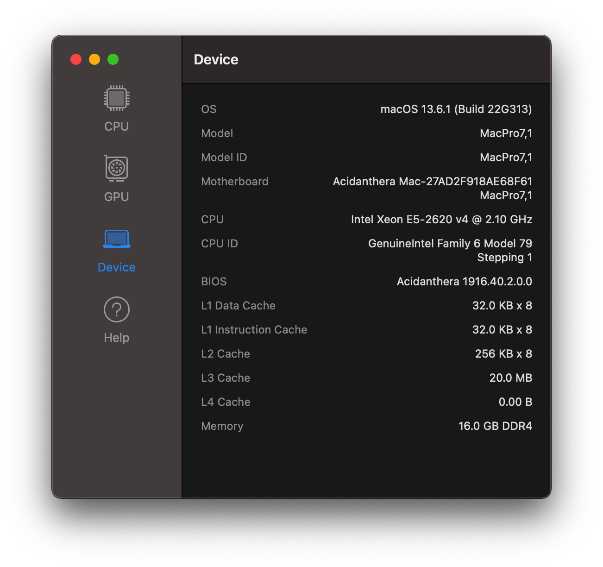
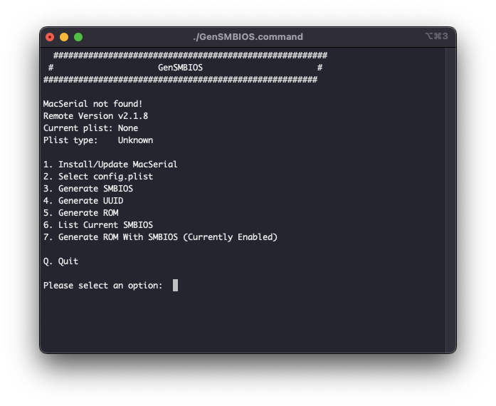
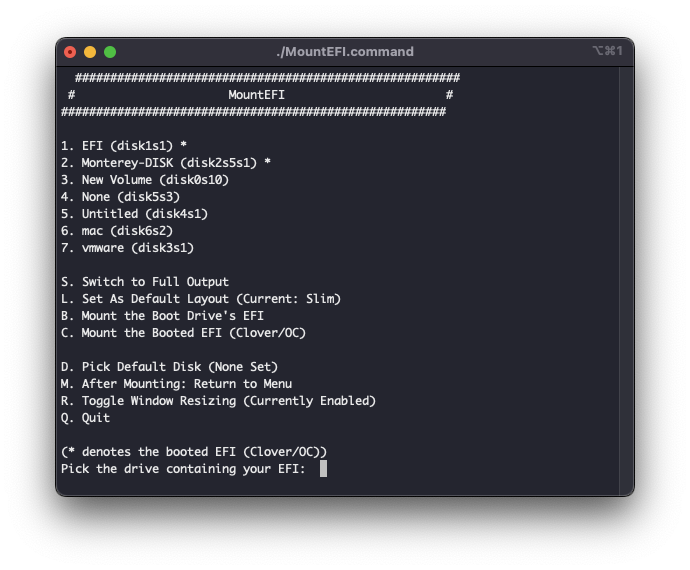
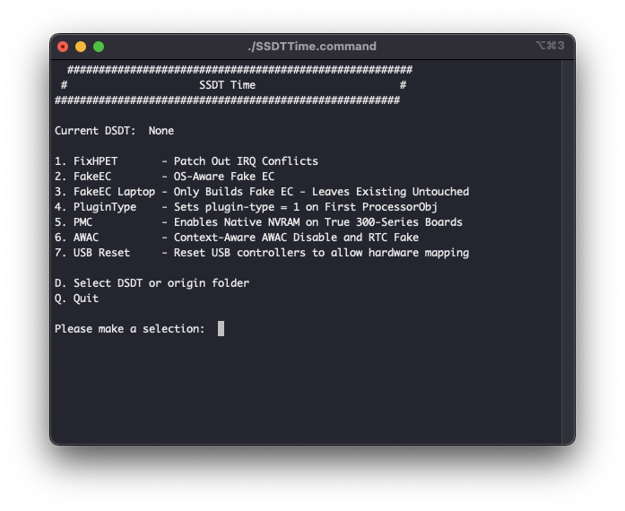
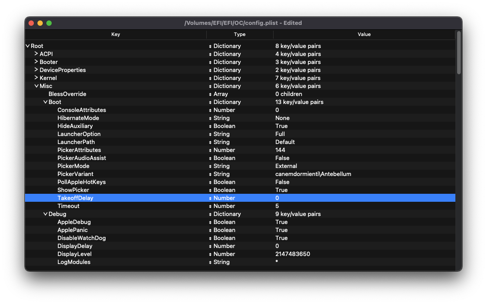

#  Lenovo P510 P710 X99 Hackintosh

Hey there, folks! 🌟 Welcome to my little corner of the digital world where we're going to chat about my snazzy EFI configuration for the Lonovo P510 and P710my custom build. 🖥️

So, what's the deal? Well, I've got ventura to work on the P510!!

Guess what's cooking? The latest and greatest – Opencore 0.9.4! 🚀 You can get the lowdown on it over at Opencore's official page.
[Opencore 0.9.4](https://github.com/acidanthera/OpenCorePkg)

Now, here's the scoop: I'm sharing my wisdom from my own experiences, and I've leaned on Dortania's Doc for some expert advice. Teamwork makes the dream work, right?

Oh, and one quick tip – if your BIOS is feeling a bit outdated, go ahead and give it a facelift! Head over to the official support page for an upgrade. It's like giving your computer a spa day! 💆‍♂️💆‍♀️

And don't worry, I've hidden some secrets in there (like Serial Numbers, MLB, ROM... shhh!). Just make sure you tweak your Config.plist to keep things on the down-low. 🤫💻✨

  

  

## GEEKBENCH RESULTS

  

## THE BUILD

  

* **CPU:** Intel(R) Xeon(R) CPU E5-2620 v4 @ 2.10GHz
* **Motherboard:** Lenovo OME
* **Memory:** Samsung LRDIMM 2x 8GB DDR4 ECC 2133MHZ
* **Storage (macOS):** x1 PCI SSD 512GB
* **GPU:** Radeon RX 580 8GB (No Graphic issues at all, nice for Graphic Acceleration )
* **Power Supply:** [Lenovo OEM 650W](https://www.lenovo.com/medias/ThinkStation-P510-Datasheet-November-2016.pdf?context=bWFzdGVyfHJvb3R8OTYwOTUyfGFwcGxpY2F0aW9uL3BkZnxoODEvaDllLzk0NTk1NDYyNTk0ODYucGRmfDFjYTU0NzI1NjJkM2VlMTg2NmMwMTBjZjNjYjdlNWQxZTg0OTQ0YjI2MWZiYzgwNGY2NWVmNGQ3ZTdiNmFjZTI)
* **Case:** Lenovo OEM
* **Audio:** Realtek ALC662

  

## UEFI SETTING

* Serial Port : `Disabled`
* CSM Support: `Enabled`
* BootOption: `UEFI and Legacy`
* XHCI/EHCI Hand-off: `Enabled`
* VTD: `Disabled`
* Intel VT: `Enabled`
* Secure boot: `Disabled`
* Fast boot: `Disabled`

## Kexts used:

- [x] Airportitlwm.kext
- [x] AppleALC.kext
- [x] AppleMCEReporterDisabler.kext
- [x] BlueToolFixup.kext
- [x] CouTscSync.kext
- [x] IntelBluetoothFirmware.kext
- [x] IntelBTPatcher.kext
- [x] IntelMausi.kext
- [x] Lilu.kext
- [x] NVMeFix.kext
- [x] RealtekRTL8111.kext
- [x] RestrictEvents.kext
- [x] SMCProcessor.kext
- [x] SMCSuperIO.kext
- [x] VirtualSMC.kext
- [x] WhateverGreen.kext
- [x] X99-XHCI.kext

## TOOLS USED

> ### [GenSMBIOS](https://github.com/corpnewt/GenSMBIOS) to generate System Serial Number and System UUID etc.

> ### [MountEFI](https://github.com/corpnewt/MountEFI) to mount the EFI partition

> ### [SSDTTime](https://github.com/corpnewt/SSDTTime) to dump DSDTs and create SSDTs

> ### [ProperTree](https://github.com/corpnewt/ProperTree) a very nice GUI plist editor

## MISCELLANEOUS

So, here's the deal, my fellow tech adventurer! 🛠️ I followed the wonderful [Dortania's OpenCore Install Guide](https://dortania.github.io/OpenCore-Install-Guide/) as my trusty roadmap on this exciting journey.

But here's the fun part – your setup might be as unique as a unicorn because of all those different components you've got in there. 🦄 So, you gotta put on your own spin and follow the guide accordingly. It's like jazz – you improvise a bit!

My CPU is a cool cat, the Haswell E, and I zeroed in on [this PART of the guide](https://dortania.github.io/Getting-Started-With-ACPI/ssdt-methods/ssdt-prebuilt.html#haswell-and-broadwell-e). You could take the easy route with Prebuilt SSDTs, but that might make your system boot slower than a snail on a hot day because of all the bloats. 🐌 I'd recommend getting your hands dirty (compiling and decompiling) or using a slick automated tool like SSDTTime.

Oh, and here's a golden rule – always give your system a 'Clean Snapshot' (Cmd+Shift+R) with Propertree after any changes in the EFI folder. It's like taking a selfie after a new haircut, just to make sure you're looking your best! 📸💇‍♂️💇‍♀️

## SETTING UP OPENCORE GUI

Fancy a little style upgrade for your Opencore setup? 🌟 I'm here to spill the beans on how you can make it look as sleek as a sports car!

First things first, Opencore is all about performance, but that doesn't mean it can't look dapper too. Themes are your new best friend, and you can dive into the world of aesthetics right here: [THEMES ARE FULLY SUPPORTED.](https://dortania.github.io/OpenCore-Post-Install/cosmetic/gui.html#setting-up-opencore-s-gui) 

Now, let's talk about the star of the show – The `Antebellum` theme. 🎩 You can grab it from the treasure chest over at Antebellum Theme. It's like giving your Opencore a snazzy new outfit for a night on the town! https://github.com/canemdormienti/Opencore-Opencanopy-Themes/tree/main/Antebellum

But, of course, there are always a few tweaks to make it shine. Just like fine-tuning a sports car to get the best performance, you'll need to make a few adjustments for everything to work like a charm. 🏎️✨

So, get ready to turn heads with your Opencore setup – it's time to make it look as sharp as a tack! 💼🌆💃

> - Add `OpenCanopy.efi` to `EFI/OC/Drivers`
> - In `Misc`, change -> Boot -> PickerMode: `External` 
> - In `Misc`, change -> Boot -> PickerAttributes: `144`
> - In `Misc`, change -> Boot -> Pickervariant: `canemdormienti\Antebellum`

I have it included in my EFI folder if you want to use that.

## CREDITS

- All thanks to the [Dortania Team](https://dortania.github.io/OpenCore-Install-Guide/misc/credit.html) for their incredible work.

- Thanks to the incredible community of [/r/hackintosh/](https://www.reddit.com/r/hackintosh/)

